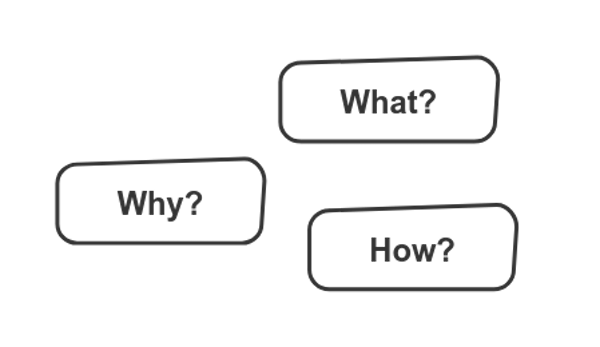
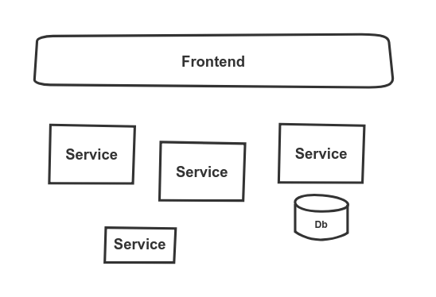
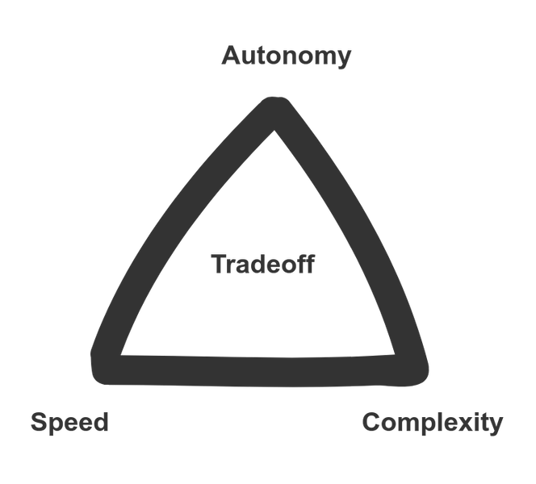
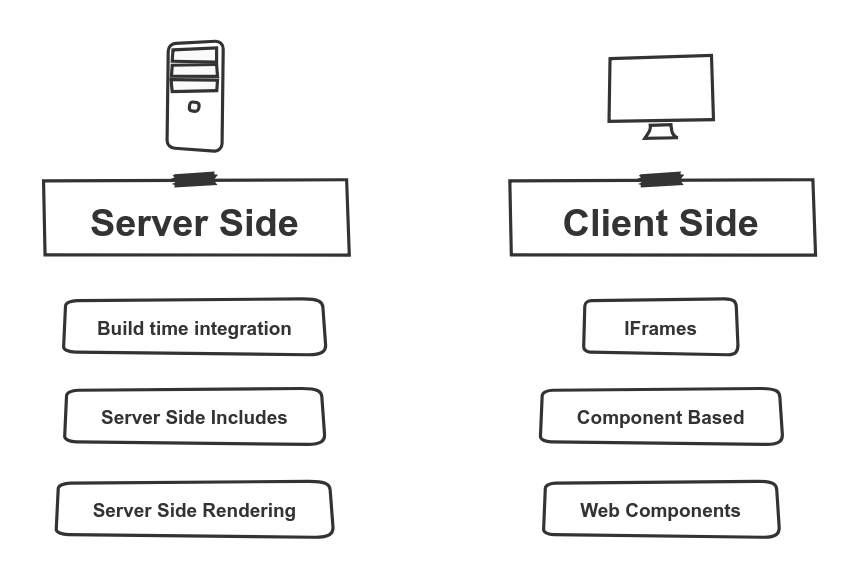
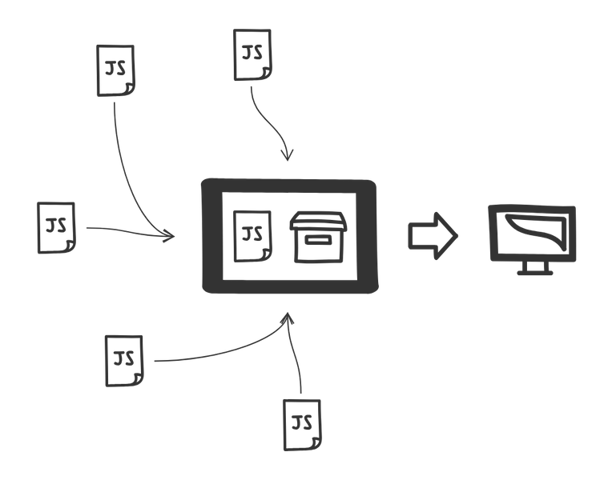
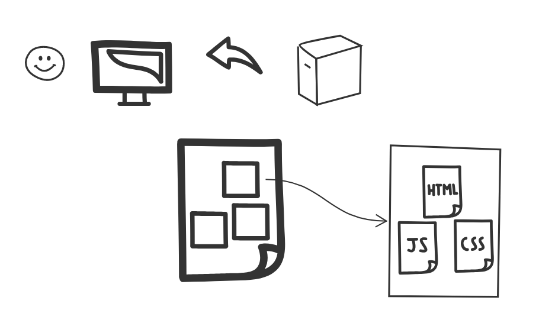
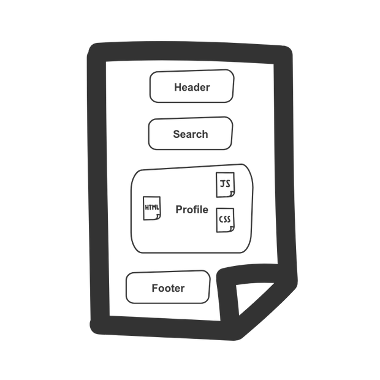

title: Introduction to Microfrontends
class: animation-fade
layout: true


<!-- This slide will serve as the base layout for all your slides -->

---

class: impact full-width

.impact-wrapper[
# {{title}}
]

---

class: center middle



???

- want to answer this 3 questions
- what is a microfrontend
- why would you use it
- how can you get started

---

class: transition

## Mario Fernandez
## Matthias Kainer
 
 **Thought**Works
 
---

class: center middle

## Everybody got into the microservices train

---

class: center middle



???

- You went through all the trouble of adopting microservices, defining boundaries
- Now the frontend remains a monolotih that is hard to deploy

---

class: center middle

.col-6[

]
.col-6.mt-5[
## Release frequency
### Backend: .green[Daily]
### Frontend: .bad-practice[Quarterly]
]

???

- This seems extreme, but it is in fact a setup that we have observed in some of our projects

---

class: center middle

## .bubble[Nov 19] Tech Radar

.bottom-right[
thoughtworks.com/de/radar
]

--

> We've seen significant benefits from introducing microservices, which have allowed teams to scale the delivery of independently deployed and maintained services. Unfortunately, we've also seen many teams create a front-end monolith — a large, entangled browser application that sits on top of the back-end services — largely neutralizing the benefits of microservices. 

--

<hr />

> Micro frontends have continued to gain in popularity since they were first introduced. We've seen many teams adopt some form of this architecture as a way to manage the complexity of multiple developers and teams contributing to the same user experience.

---

class: transition

# What are microfrontends?

---

class: center middle

## An architectural style where independently deliverable frontend applications are composed into a greater whole

---

class: center middle

## From the developers perspective

---

class: center middle


.bottom-right[
microfrontends.com
]

???

- the frontend is now a collection of different apps
- Before being delivered to the end user, it is composed in *some way*
- We'll talk about different ways later

---

class: center middle

## From the users perspective

---

class: center middle


.bottom-right[
microfrontends.com
]

???

- The user should not realize the page is composed by microfrontends

---

class: center middle

### martinfowler.com/articles/micro-frontends.html

???

- There is an article from a colleague from us which goes into a lot of detail

---

class: transition

# Why use them?

---

class: center middle

## Incremental updates

???

- no big bang releases

---

class: center middle

## Independent deployments

???

- path to production

---

class: center middle

## Autonomous teams

???

- vertical slicing instead of horizontal slicing

---

class: transition
# Should you use microfrontends?

---

class: center middle

## Not everybody is sold

---

class: center middle


???

- when the article on Martin Fowler's site appeared, there was a strong pushback on twitter

---

class: center middle



???

- Tradeoffs involved
- In order to gain autonomy, we have to sacrifice speed or increase complexity

---

class: center middle

## Factors to consider

---

class: center middle

## Are your teams...

.col-6[
### Vertically divided
]

.col-6[
### Horizontally divided
]

???

- i.e: divided around products or technical layers

---

class: center middle

## Is your priority...

.col-6[
### Fast time to market
]

.col-6[
### High UX consistency
]

???

- i.e: divided around products or technical layers

---

class: center middle

## Are you releasing your application...

.col-6[
### Once every quarter
]

.col-6[
### Once every hour
]

???

- If you are already at a high level of maturity, you might not need this

---

class: transition

# Integration approaches

---

class: center middle



???

- This are some of the approaches we will be talking about, which have been included in different ways in different projects of us
- additionally, we'll talk about some other relevant concerns when implementing microfrontends

---

class: transition center middle

# Build time integration

---

class: center middle

## Divide the application into separate npm packages, which are deployed as one entity 

---

class: center



---

class: center middle

```json
{
  "name": "@awesome-corp/container",
  "version": "1.0.0",
  "dependencies": {
    "@awesome-corp/search": "^1.2.3",
    "@awesome-corp/profile": "^7.8.9",
    "@awesome-corp/header": "^0.1.2",
    "@awesome-corp/footer": "^0.2.5"
  }
}
```

---

class: center middle

```html
<BrowserRouter>
  <CssBaseline />
  <Header />

  <Box mt={12}>
    <Container component="main">
      <Switch>
        <Route path="/search" component={Search} />
        <Route path="/profile" component={Profile} />
      </Switch>
    </Container>
  </Box>

  <Footer />
</BrowserRouter>
```

---

class: center middle

## Lerna

.bottom-right[
github.com/lerna/lerna
]

???

- monorepo approach is possible

---

class: center middle

```plaintext
lerna.json
package.json
packages/
  main/
  header/
  footer/
  microfrontend1/
  microfrontend2/
```

---

class: center middle

```json
{
  "lerna": "3.15.0",
  "version": "independent",
  "npmClient": "yarn",
  "useWorkspaces": true,
  "packages": ["packages/*"]
}
```

---

class: center middle

## .green[✔] Simple

---

class: center middle

## .red[❌] Independent deployments

---

class: center middle

## Good as a starting point

---

class: transition center middle

## Server Side Includes

???

- algo Edge Side Includes in Varnish

---

class: center middle

## What is a SSI?

---

class: center middle

> Server Side Includes (SSI) is a simple interpreted server-side scripting language used almost exclusively for the World Wide Web. It is most useful for including the contents of one or more files into a web page on a web server, using its #include directive.

---

class: center middle


```html
<html lang="en" dir="ltr">
  <head>
    <meta charset="utf-8">
    <title>SSI Example</title>
  </head>
  <body>
    <h1>Static header</h1>
    <hr/>
    <!--# include file="$PAGE.html" -->
  </body>
</html>
```

---

```nginx
server {
    listen 8080;
    index index.html;
    ssi on;

    # Decide which HTML fragment to insert based on the URL
    location /browse {
        set $PAGE 'browse';
    }

    location /order {
        set $PAGE 'order';
    }

    location /profile {
        set $PAGE 'profile';
    }
}
```

---

class: center middle

## Where is the microfrontend here?

---

class: center middle



???

- not necessarily a new idea

---

class: center middle



---

class: center middle

## .green[✔] (Still) Simple

---

class: center middle

## .red[❌] Managing assets

---

class: center middle

### thoughtworks.com/talks/a-high-performmance-solution-to-microservice-ui-composition

---

class: transition center middle

# Backend interaction

---

class: center middle

## Backend for frontend

.bottom-right[
samnewman.io/patterns/architectural/bff/
]

---

class: center middle

## A custom backend for a particular client
### Tightly coupled
### Owned by the same team

---

class: center middle


---

class: center middle

## Microfrontends talk to their own BFF

???

- makes sense to enforce this rule

---

class: center middle

## Avoids coupling

???

- we don't want to lose the benefits we got from switching to this architecture

---

class: center middle

## Chatty applications make your life harder

???

- you cannot avoid communication between microfrontends, but you can reduce it
- can be a sign of a bad domain boundary

---

class: transition center middle

# CI/CD

---

class: center middle

## Smaller clients => Smaller deployments

---

class: center middle full-width white
background-image: url(images/single-pipeline.png)

---

class: center middle

### github.com/sirech/talks/raw/master/2019-04-tw-build_pipelines.pdf

---

THIS IS THE PRESENTATION BREAK SO THAT WE CAN ADD SLIDES WITHOUT GIT HAVING ISSUES AT THE END OF THE FILE

Let's remember to remove that slide, shall we?

---

class: transition center middle

# THEORY
##  Not everything on a website can be put behind a shared Varnish

---

## Not everything on a website can be put behind a shared Varnish

### Assumptions

---

## Not everything on a website can be put behind a shared Varnish

### Assumptions
1. There exists a setup where multiple teams create content for one website

---

## Not everything on a website can be put behind a shared Varnish

### Assumptions
1. There exists a setup where multiple teams create content for one website
2. There exist at least two teams in the world that don't share the same tool/infrastructure

---

## Not everything on a website can be put behind a shared Varnish

### Assumptions
1. There exists a setup where multiple teams create content for one website
2. There exist at least two teams in the world that don't share the same tool/infrastructure

### Statement
If 1. and 2. are true there exists a number `x` of websites that are build by teams not sharing the same tools/infrastructure, where `x > 0`

---

## Not everything on a website can be put behind a shared Varnish

### Assumptions
1. There exists a setup where multiple teams create content for one website
2. There exist at least two teams in the world that don't share the same tool/infrastructure

### Statement
If 1. and 2. are true there exists a number `x` of websites that are build by teams not sharing the same tools/infrastructure, where `x > 0`

### Proof

---

## Not everything on a website can be put behind a shared Varnish

### Assumptions
1. There exists a setup where multiple teams create content for one website
2. There exist at least two teams in the world that don't share the same tool/infrastructure

### Statement
If 1. and 2. are true there exists a number `x` of websites that are build by teams not sharing the same tools/infrastructure, where `x > 0`

### Proof
.red[
  Ads
]

---

class: center middle

## Microfrontends in the Browser
##  &nbsp;

---

class: center middle

## Microfrontends in the Browser
##  are really old

---

class: center middle full-width white
background-image: url(images/matthias/microfrontend-in-the-browser.png)

---

class: center middle full-width white
background-image: url(images/matthias/microfrontend-in-the-browser-wayback.png)

---

class: center middle

## Microfrontends in the Browser
##  are even older than that

---

class: center middle

The wonderful world of (i)Frames
  
<iframe src="https://www.matthias-kainer.de" style="width:45%; display:inline-block; height: 400px;"></iframe>
<iframe src="https://www.8select.com/events/l8-birds#upcomingspeaker" style="width:45%; display:inline-block; height: 400px;"></iframe>

---

class: center middle full-height white
background-image: url(images/matthias/frames.png)

---

```html
  <body>
    <header><iframe src="/parts/shopping-card"></iframe></header>
    <nav><!-- shared navigation --></nav>
    <iframe id="micro-frontend-container"></iframe>

    <script type="text/javascript">
      const {search, pathname} = window.location;
      const microFrontendsByRoute = {
        '/': '/parts/search' + search,
        '/product': '/parts/product' + search
      };
      document.getElementById('micro-frontend-container')
        .src = microFrontendsByRoute[pathname];
    </script>
  </body>
```

---

class: right middle

## .green[✔] Very Simple
## &nbsp;

---

class: right middle

## .green[✔] Very Simple
## .green[✔] Isolated

---

class: middle

## .red[❌] Very Hard To Do Responsive
## &nbsp;
## &nbsp;
## &nbsp;

---

class: middle

## .red[❌] Very Hard To Do Responsive
## .red[❌] Routing can be tricky
## &nbsp;
## &nbsp;

---

class: middle

## .red[❌] Very Hard To Do Responsive
## .red[❌] Routing can be tricky
## .red[❌] SEO is "interesting"
## &nbsp;

---

class: middle

## .red[❌] Very Hard To Do Responsive
## .red[❌] Routing can be tricky
## .red[❌] SEO is "interesting"
## .red[❌] Very Isolated (`window.postMessage` can help)

---

class: center middle

## Detour: Communication in the Browser

```javascript

window.addEventListener("message", (evt) => {
  if (evt.source === window && evt.origin === "https://matthias-kainer.de"){
    console.log("Doing things with: ", evt.data)
  } else {
    console.log("not trusted")
  }
}, false);

window.postMessage("The secret world of secrets is secret", "https://matthias-kainer.de")

```

---

class: right middle

## .green[✔] Immune to network lags!
## &nbsp;
## &nbsp;

---

class: right middle

## .green[✔] Immune to network lags!
## .green[✔] Can be made pretty secure (also against extensions)
## &nbsp;

---

class: right middle

## .green[✔] Immune to network lags!
## .green[✔] Can be made pretty secure (also against extensions)
## .green[✔] Very lightweight and can help you to think in events

---

class: middle

## .red[❌] Needs some extra love from you to support things like queuing/delivery guarantees
## &nbsp;
## &nbsp;

---

class: middle

## .red[❌] Needs some extra love from you to support things like queuing/delivery guarantees
## .red[❌] If you can't trust yourself to not forget checks, then don't 
## &nbsp;

---

class: middle

## .red[❌] Needs some extra love from you to support things like queuing/delivery guarantees
## .red[❌] If you can't trust yourself to not forget checks, then don't 
## .red[❌] If you can't trust your user, don't rely solely on it

---

class: transition center middle

# Module Loading
## different approaches

---

class: center middle full-height white
background-image: url(images/matthias/comparision.png)

---

class: center middle

## Pinning the version for a dependency?
### It's a .red[TECH DEBT], friend

---

class: center middle

## single-spa
### It's only one example, there are more

---

class: center middle

## DEMO TIME

---

class: center middle

```js
      System.import("single-spa").then(function(singleSpa) {
        singleSpa.registerApplication(
          "@matthias-kainer/the-3000",
          () => System.import("@matthias-kainer/the-3000"),
          location => location.pathname.startsWith("/react")
            || location.pathname.startsWith("/both")
        );
        singleSpa.registerApplication(
          '@matthias-kainer/the-1337',
          () => System.import('@matthias-kainer/the-1337'),
          location => location.pathname.startsWith('/vue')
            || location.pathname.startsWith("/both")
        );
        singleSpa.start();
      });
```

---

class: center middle

## Wait, how does it import?!
### Detour: Managing your imports in the browser with import-maps

---

class: center middle

```html
<script type="systemjs-importmap">
  {
    "imports": {
      "react": "https://cdn.jsdelivr.net/npm/react@16.12.0/umd/react.production.min.js",
      "react-dom": "https://cdn.jsdelivr.net/npm/react-dom@16.12.0/umd/react-dom.production.min.js",
      "single-spa": "https://cdn.jsdelivr.net/npm/single-spa@4.4.1/lib/system/single-spa.min.js",
      "@matthias-kainer/the-1337": "https://localhost:1337/js/app.js",
      "@matthias-kainer/the-3000": "https://localhost:3000/matthias-kainer-the-3000.js"
    }
  }
</script>
```

.bottom-right[
https://wicg.github.io/import-maps/
]

---

class: center middle

## webpack

---

class: transition center middle

# WebComponents 
## Browser-supported Microfrontend-fragments

---

class: middle full-width white

<video style="width:100%;height:100%;" playsinline="" autoplay="" muted="" loop="">
  <source src="/images/matthias/digital clock - almost no updates.mp4" type="video/mp4">
</video>

.bottom-right.small.small-paragraph.right[
a webcomponent with a clock

using a webcomponent with digits
]

---

class: center middle

```js
class ClockDigit extends HTMLElement {
    constructor() { super(); }

    get digit() { return this.getAttribute("digit"); }

    set digit(value) {
        this.setAttribute("digit", value); this._showDigit()
    }

    connectedCallback() { this._showDigit(); }

    _showDigit() {
        this.innerText = this.getAttribute("digit");
    }
}

window.customElements.define(`digital-clock-character`, ClockDigit);
```

---

class: full-width white

<video style="width:100%;" playsinline="" autoplay="" muted="" loop="">
  <source src="/images/matthias/webcomponent.mov" type="video/mp4">
</video>

.bottom-right.small.small-paragraph.right[
https://jsfiddle.net/8p9q7jeu/2/
]

---

class: right middle

## .green[✔] Simple and lib-less
## &nbsp;
## &nbsp;

---

class: right middle

## .green[✔] Simple and lib-less
## .green[✔] As isolated as you need it
## &nbsp;

---

class: right middle

## .green[✔] Simple and lib-less
## .green[✔] As isolated as you need it
## .green[✔] Browser support is getting strong

---

class: middle

## .red[❌] Chatty class-based inflexible structure
## &nbsp;
## &nbsp;

---

class: middle

## .red[❌] Chatty class-based inflexible structure
## .red[❌] Tracking attribute values can be hard
## &nbsp;

---

class: middle

## .red[❌] Chatty class-based inflexible structure
## .red[❌] Tracking attribute values can be hard
## .red[❌] A lot of things that would make your life easier (i.e. css styling tweaks, Constructible Stylesheets) still not widely supported or feels heavy/complicated

---

class: transition center middle

# So... 
## how do you have it with microfrontends?

---

class: center middle full-height white
background-image: url(images/matthias/this-tall.jpg)

---

